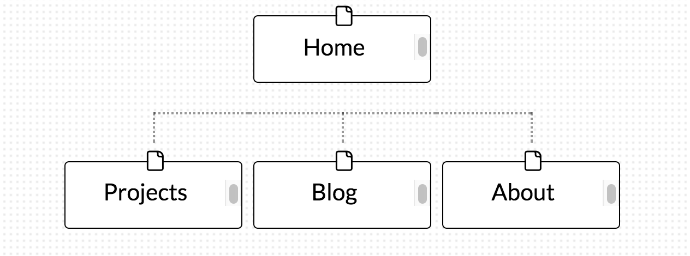

# 2.3 Design Reflection

###1. What are the 6 Phases of Web Design?

The 6 phases of web design are:

**- Information Gathering:** It's very important to understand what you are going to be building and designing before you start.

* What is the purpose of the website?
* What are you trying to accomplish?
* Who is your audience?
* And what is going to be the content of your website?

**-Planning:** After you gathered the information you need to come up with a plan, also called a site map. A site map is basically a list of all the important topics of the site and their sub topics. It will help you to create a consistent easy to understand navigational system.

**-Design:** After you have your basic information and the site map you can start thinkning about design. Create a wireframe which is *a skeletal three-dimensional model in which only lines and vertices are represented*. And choose colors, fonts and images. Think about potential audience and what they would be interested in. For example a website for a law firm would look totally different than a website that is fashion oriented. It's also important to make prototypes of what the potential website will look like.

**-Development:** At this point you will take all the information you gathered so far and use it to create the actual working website. It's typically done by making the home page first and creating a "shell" for the other pages. The "shells" serves as a template for the content pages of the site. A successful website involves writing valid HTML and CSS code that is on par with current web standarts.

**-Testing and Delivery:** At this stage you would do the final testing of the web site, make sure everything looks and works as planned and that the website is optimized for different browsers and devices. You will also upload the site to your server and setup domain name registration and hosting. After everything is setup and the site is uploaded you should do one more run-through to confirm that everything was uploaded properly and the website is full operational.

**-Maintanence:** Even after you are finished with your website design and it's fully functional you need to keep maintaining it by adding updated content, backups, and cheking for various errors.

It's important to understand that each and every step is vital for creating a fully functional beautiful and meaningful website, that will stand out and be successful.

###2. What is your site's primary goal or purpose? What kind of content will your site feature?

The primary goal for me is to have an online portfolio where I can present my work to potential employers. The content will consist of my bio, different projects that I've done as well as a blog reflecting on my learning experiences and miscellanious subjects. Links to a variety of my social networks will also be included.

###3. What is your target audience's interests and how do you see your site addressing them?

I'm expecting the audience of my website to be tech driven people. Potentially looking for a freelancer.

###4. What is the primary "action" the user should take when coming to your site? Do you want them to search for information, contact you, or see your portfolio? It's ok to have several actions at once, or different actions for different kinds of visitors.

The primary action would be to look at my work, what I have accomplished and what I am capable of. They shoud also be able to read my blog and contact me through the various social networks.

###5. What are the main things someone should know about design and user experience?

I think the main thing is that there is no such things as one size fits all. Design and user experience is very subjective. One person might like the green menu and the layout of the links and another might hate it.
Every website will have it's own 'perfect' design and it depends on the type of the website, it's visitors etc.
So each design and user experience needs to be hand crafted from scratch for every project in order to make an impact.

###6. What is user experience design and why is it valuable?

User experience design, also know as UXD or UED is the process in which the designer improves the way a user interacts with the product. It can be by changing the layout of the website or the color scheme, to make it more pleasant to the eye or to make the navigation through the website more fluent.
It is valuable because you want to make sure that your product is accessible to
as many people as possible and that their experience from using your product is outstanding in terms of satisfaction and usability. It will give you better feedback and in some cases like ['this article'](https://articles.uie.com/three_hund_million_button/), an amazing increase in revenue!

###7. Which parts of the challenge did you find tedious?

By far the reading researching and reflecting  on all the material took me the most amount of time and was definitely tedious!