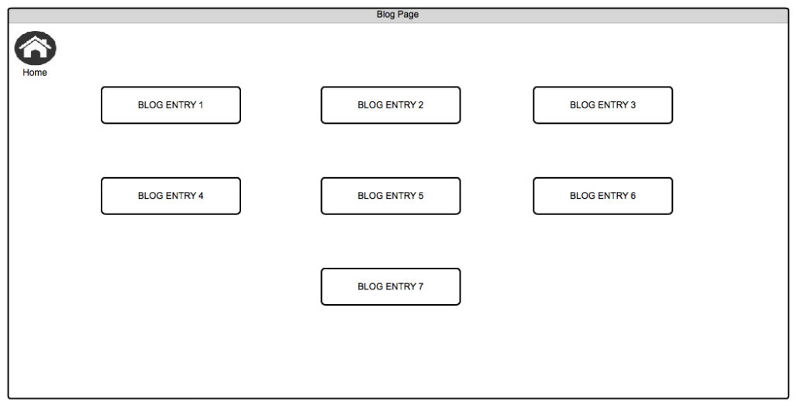

###1. What is a wireframe?

A wireframe is a sketch of the basic skeletal concepts of the website, it mainly consits of the layout of your pages like lines, boxes, buttons and their position.

###2. What are the benefits of wireframing?

The benefits of wireframing is to get an idea of what the website will look like before you start working on it. They are fairly easy to make so you can try several approaches to your website and see which one works best for your needs.
It allows you to change things easily and quickly, and it helps the actual code writing a bit easier since you already know what elements you are going to use.

###3. Did you enjoy wireframing your site?

I did enjoy wireframing, never tried it before it was quite fun.

###4. Did you revise your wireframe or stick with your first idea?

Since the website I'm creating is fairly basic and simple I just stuck with my initial idea, also I didn't want to spend too much time on it.

###5. What questions did you ask during this challenge? What resources did you find to help you answer them?
The only question I asked myself was "What should my website look like?"
And the only resource that I used was the depth of my brain. :)

###6. Which parts of the challenge did you enjoy and which parts did you find tedious?

I enjoyed this challenge overall. Nothing felt tedious but it took me some time to get used to the wireframing software that I used. ( Lovely Charts ) I enjoyed the process of it after I played around with it for a bit and got more comfortable with it.